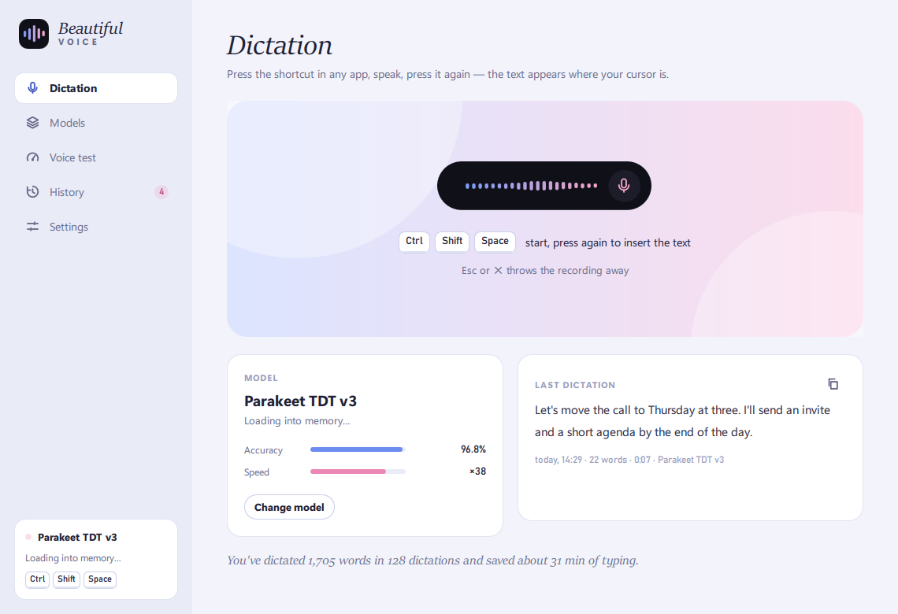
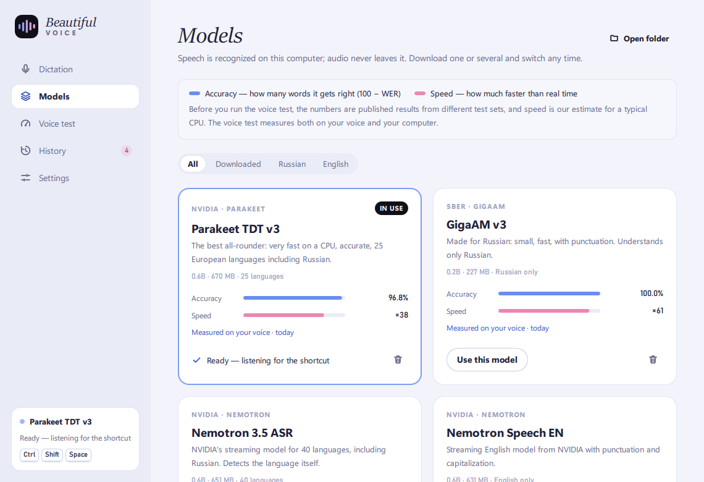
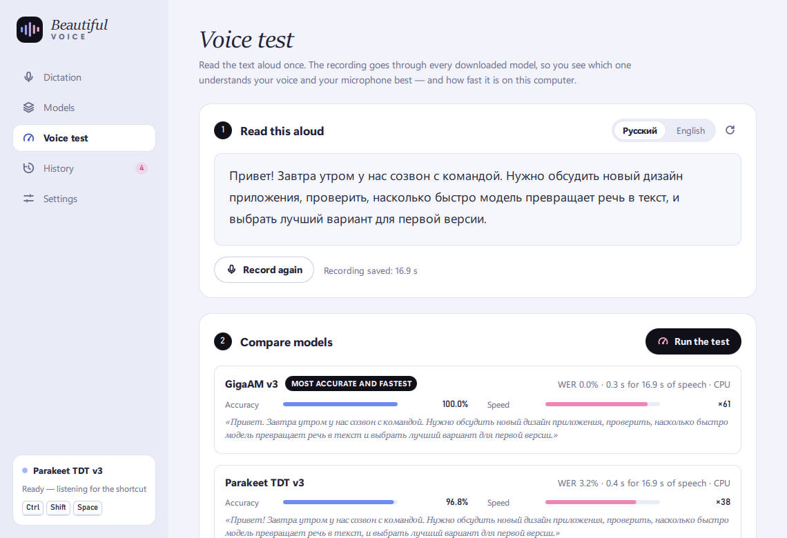

<p align="center">
  
</p>

<h1 align="center">Beautiful Voice</h1>

<p align="center">
  Local dictation for the desktop. Press a shortcut in any app, speak, press it again — the text appears where your cursor is.<br>
  Speech is recognized on your computer by open models (Parakeet, Nemotron, Canary, GigaAM, Whisper). Nothing is sent anywhere.
</p>

<p align="center">
  <a href="https://github.com/qpsychocode/beautiful-voice/releases/latest/download/BeautifulVoice-windows.zip"><b>Download for Windows</b></a> ·
  <a href="https://beautiful-voice.vercel.app">Website</a> ·
  <a href="README.ru.md">Читать по-русски</a>
</p>

<p align="center">
  
</p>



## What it does

- **Works in any app.** `Ctrl + Shift + Space` starts recording from anywhere; a black pill appears at the bottom of the screen with bars that follow your voice, a timer and a ✕. Press the shortcut again and the text is pasted into the field you were typing in. `Esc` or ✕ throws the recording away.
- **Fast by design.** While you talk, finished phrases are already being recognized in the background, so when you stop only the last phrase is left. With Parakeet on an ordinary CPU, the text lands about half a second after you press the shortcut.
- **Pick your model and see how good it is.** Every model card shows two measures: accuracy in blue, speed in pink. Before you test anything, the numbers are published results. The **Voice test** then runs one recording of your voice through every downloaded model and shows which one understands *you* best and how fast it runs on *your* computer.
- **Hold or toggle.** Press twice, or hold the keys while you talk.
- **History with a limit you choose.** The last N dictations are kept (10 by default); the oldest one is deleted when a new one arrives.
- **Stays out of the way.** Lives in the tray, can start with Windows, restores your clipboard after pasting, and keeps dictated text out of the Windows clipboard history.
- **Ready on first start.** The default model downloads by itself the first time you open the app.
- Light and dark themes. The interface speaks English, 中文, हिन्दी, Español, Français, Português, Русский, Deutsch and 日本語.



## Models

All models run locally through [onnx-asr](https://github.com/istupakov/onnx-asr), [sherpa-onnx](https://github.com/k2-fsa/sherpa-onnx) or [faster-whisper](https://github.com/SYSTRAN/faster-whisper). They are downloaded from Hugging Face the first time you pick them.

| Model | Languages | Download | Published WER |
|---|---|---|---|
| **Nemotron 3.5 ASR** (NVIDIA) — default | 32 incl. Chinese, Hindi, Spanish, French, Arabic, Russian, German, Japanese | 651 MB | 8.72 % EN¹ · 4.11 % ES⁴ · 6.81 % HI⁴ · 9.17 % RU² · 19.3 % ZH⁴ |
| Parakeet TDT v3 (NVIDIA) | 25 European incl. Russian | 670 MB | 5.66 % EN¹ · 5.51 % RU² |
| Parakeet TDT v2 (NVIDIA) | English | 661 MB | 5.48 % EN¹ |
| Nemotron Speech EN (NVIDIA) | English | 631 MB | 6.00 % EN¹ |
| Canary 1B v2 (NVIDIA) | 25 European incl. Russian | 1.03 GB | 6.55 % EN¹ · 6.90 % RU² |
| GigaAM v3 (Sber) | Russian | 227 MB | 11.2 % RU³ |
| Whisper Large v3 Turbo (OpenAI) | 99 | 1.6 GB | 7.03 % EN¹ |
| Whisper Large v3 (OpenAI) | 99 | 3.1 GB | 6.50 % EN¹ · 21.0 % RU³ |
| Distil-Whisper v3.5 | English | 1.5 GB | 6.20 % EN¹ |
| Whisper Small / Base (OpenAI) | 99 | 485 / 146 MB | — |

¹ [Open ASR Leaderboard](https://huggingface.co/spaces/hf-audio/open_asr_leaderboard), English, 2026-09-19 snapshot · ² FLEURS, from the NVIDIA model cards · ³ [GigaAM evaluation](https://github.com/salute-developers/GigaAM/blob/main/evaluation.md), average of 10 Russian test sets · ⁴ [Nemotron 3.5 model card](https://huggingface.co/nvidia/nemotron-3.5-asr-streaming-0.6b), 1.12 s chunks (Chinese is a character error rate).
These come from different test sets, so compare them loosely — the voice test gives you numbers measured on the same recording.

Accuracy is shown as `100 − WER`. Speed is how many times faster than real time a model processes speech; on the cards it's an estimate until you run the voice test.



## Install

### Download

Get `BeautifulVoice-windows.zip` from the [latest release](https://github.com/qpsychocode/beautiful-voice/releases/latest), unzip it anywhere and run `BeautifulVoice.exe`. The app isn't code-signed yet, so Windows SmartScreen may ask you to confirm: *More info → Run anyway*.

### From source (Windows, Python 3.10+, tested on 3.11)

```bash
git clone https://github.com/qpsychocode/beautiful-voice
cd beautiful-voice
python -m venv .venv
.venv\Scripts\pip install -r requirements.txt
.venv\Scripts\pythonw run.pyw
```

`python -m beautiful_voice` works too; `--minimized` starts it in the tray.

### Build a standalone app

```bash
.venv\Scripts\pip install pyinstaller
.venv\Scripts\pyinstaller packaging\beautiful_voice.spec --noconfirm
```

The app ends up in `dist\BeautifulVoice\BeautifulVoice.exe`.

## Using it

1. On first start the default model (Nemotron 3.5 ASR) downloads by itself. Others are on the **Models** page: Parakeet TDT v3 is the most accurate for European languages, GigaAM v3 the smallest and very good for Russian.
2. Click into any text field — a chat, an email, your editor.
3. Press `Ctrl + Shift + Space`, speak, press it again. The text is pasted where the cursor is.

Change the shortcut, switch to hold-to-talk, pick a microphone or a speech language in **Settings**.

## Where your data lives

- Settings, history and the voice-test recording: `%APPDATA%\BeautifulVoice`
- Models: `%LOCALAPPDATA%\BeautifulVoice\models`

Audio from dictation is never written to disk; only the text goes into history. Set `BEAUTIFUL_VOICE_HOME` to keep everything in one folder (portable mode).

## Platforms

Windows 10/11 is the primary target: the global shortcut, focus-safe overlay and clipboard handling use Win32 directly. The code runs on macOS and Linux with a `pynput` fallback for the shortcut and pasting, but those paths are less tested — contributions are welcome.

## Development

```bash
.venv\Scripts\pip install pytest
.venv\Scripts\python -m pytest
```

```
beautiful_voice/
  app.py          wiring: settings, models, hotkey, tray, QML
  dictation.py    record → recognize phrase by phrase → insert
  segmenter.py    splits live audio at pauses
  hotkeys.py      global shortcut (RegisterHotKey on Windows)
  inserter.py     paste / type into the focused app, clipboard save and restore
  models/         catalog, downloader, engines for each backend
  benchmark.py    the voice test (WER + real-time factor)
  backend.py      everything the interface talks to
  qml/            the interface (Qt Quick)
```

`python tools/seed_demo.py <dir>` fills a throwaway profile with sample data; with `BEAUTIFUL_VOICE_HOME=<dir>`, `python -m beautiful_voice --shots docs/screenshots` renders the screenshots in this README.

## Credits

Speech models by NVIDIA (Parakeet, Canary, Nemotron), Sber (GigaAM) and OpenAI (Whisper), each under its own license — see the model pages on Hugging Face. ONNX exports by [istupakov](https://huggingface.co/istupakov) and [k2-fsa](https://github.com/k2-fsa/sherpa-onnx). Beautiful Voice itself is MIT-licensed.
