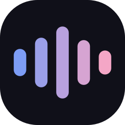

<p align="center">
  
</p>

<h1 align="center">Beautiful Voice</h1>

<p align="center">
  Локальная диктовка для компьютера. Нажмите сочетание клавиш в любом приложении, говорите, нажмите ещё раз — текст появится там, где стоит курсор.<br>
  Речь распознаётся на вашем компьютере открытыми моделями (Parakeet, Nemotron, Canary, GigaAM, Whisper). Никуда ничего не отправляется.
</p>

<p align="center">
  <a href="https://github.com/qpsychocode/beautiful-voice/releases/latest/download/BeautifulVoice-windows.zip"><b>Скачать для Windows</b></a> ·
  <a href="https://beautiful-voice.vercel.app">Сайт</a> ·
  <a href="README.md">English</a>
</p>

<p align="center">
  
</p>

## Что умеет

- **Работает в любом приложении.** `Ctrl + Shift + Space` начинает запись откуда угодно: внизу экрана появляется чёрная плашка с полосками, которые двигаются в такт голосу, таймером и ✕. Нажмите сочетание ещё раз — текст вставится в поле, где вы печатали. `Esc` или ✕ выбрасывают запись.
- **Быстро.** Пока вы говорите, законченные фразы уже распознаются в фоне, и после остановки остаётся только последняя. С Parakeet на обычном процессоре текст появляется примерно через полсекунды после нажатия.
- **Видно, насколько модель хороша.** На каждой карточке две шкалы: точность синим, скорость розовым. До теста это опубликованные результаты. **Тест голоса** прогоняет одну запись вашего голоса через все скачанные модели и показывает, какая лучше понимает именно вас и как быстро работает на вашем компьютере.
- **Нажать дважды или удерживать** — как удобнее.
- **История с лимитом.** Хранятся последние N диктовок (по умолчанию 10); при новой самая старая удаляется.
- **Не мешает.** Живёт в трее, может стартовать вместе с Windows, возвращает содержимое буфера обмена после вставки и не засоряет журнал буфера Windows.
- **Готово с первого запуска.** Модель по умолчанию скачивается сама при первом открытии.
- Светлая и тёмная темы. Интерфейс на 9 языках: English, 中文, हिन्दी, Español, Français, Português, Русский, Deutsch, 日本語.

## Модели

| Модель | Языки | Размер | Опубликованный WER |
|---|---|---|---|
| **Nemotron 3.5 ASR** (NVIDIA) — по умолчанию | 32, включая китайский, хинди, испанский, арабский, русский | 651 МБ | 8,72 % англ.¹ · 9,17 % рус.² |
| Parakeet TDT v3 (NVIDIA) | 25 европейских, включая русский | 670 МБ | 5,66 % англ.¹ · 5,51 % рус.² |
| GigaAM v3 (Сбер) | русский | 227 МБ | 11,2 % рус.³ |
| Canary 1B v2 (NVIDIA) | 25 европейских, включая русский | 1,03 ГБ | 6,55 % англ.¹ · 6,90 % рус.² |
| Whisper Large v3 Turbo / v3, Small, Base (OpenAI) | 99 | 146 МБ – 3,1 ГБ | см. [README](README.md) |
| Parakeet TDT v2, Nemotron Speech EN, Distil-Whisper | английский | 0,6–1,5 ГБ | см. [README](README.md) |

¹ Open ASR Leaderboard · ² FLEURS, карточки моделей NVIDIA · ³ оценка GigaAM, среднее по 10 русским наборам. Наборы разные, поэтому сравнивайте осторожно — тест голоса даёт цифры на одной и той же записи.

## Установка из исходников

```bash
git clone https://github.com/qpsychocode/beautiful-voice
cd beautiful-voice
python -m venv .venv
.venv\Scripts\pip install -r requirements.txt
.venv\Scripts\pythonw run.pyw
```

Сборка в отдельное приложение: `pyinstaller packaging\beautiful_voice.spec --noconfirm` → `dist\BeautifulVoice\BeautifulVoice.exe`.

## Как пользоваться

1. При первом запуске модель по умолчанию (Nemotron 3.5 ASR) скачается сама. Остальные — на странице «Модели»: Parakeet TDT v3 точнее всех на европейских языках, GigaAM v3 самая маленькая и отлично понимает русский.
2. Поставьте курсор в любое текстовое поле.
3. `Ctrl + Shift + Space`, говорите, `Ctrl + Shift + Space`. Готово.

Настройки, история и запись для теста лежат в `%APPDATA%\BeautifulVoice`, модели — в `%LOCALAPPDATA%\BeautifulVoice\models`. Звук диктовки на диск не пишется, в историю попадает только текст.

Лицензия MIT.
